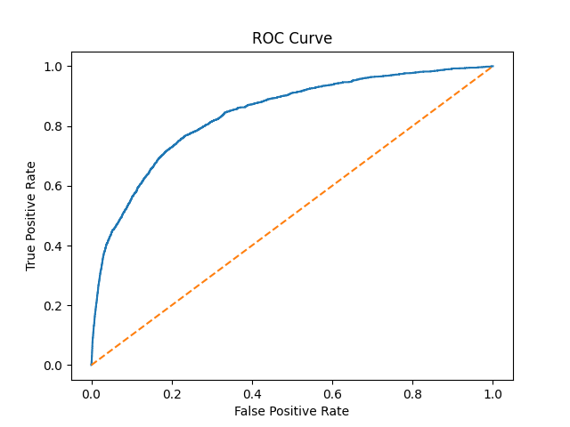

# Credit Risk Prediction using Machine Learning

## Project Overview

In this project, I developed a machine learning pipeline to predict **credit default risk** using financial and behavioral customer data. The goal is to identify borrowers who are likely to default and support better credit decision-making.

Credit risk prediction is an important problem in the banking and financial industry. Financial institutions must evaluate whether a customer is likely to fail to repay a loan. Data-driven models help reduce financial losses and improve risk management.

In this project, I performed the complete workflow of a real-world machine learning project including:

* Data exploration and understanding the dataset
* Data cleaning and preprocessing
* Handling missing values and outliers
* Feature analysis
* Training baseline and advanced models
* Model evaluation and threshold optimization
* Cost-based decision analysis
* Model explainability using SHAP

The goal was not only to build a predictive model but also to **understand why the model makes certain predictions and how those predictions affect business decisions.**

---

# Dataset

The dataset contains **150,000 customer records** with financial and behavioral attributes.

The target variable is:

**SeriousDlqin2yrs**

* `1` → Customer experienced serious delinquency within two years
* `0` → Customer did not default

The dataset includes several financial indicators such as:

* RevolvingUtilizationOfUnsecuredLines
* DebtRatio
* MonthlyIncome
* Age
* NumberOfOpenCreditLinesAndLoans
* NumberOfTimes30-59DaysPastDueNotWorse
* NumberOfTimes60-89DaysPastDueNotWorse
* NumberOfTimes90DaysLate
* NumberRealEstateLoansOrLines
* NumberOfDependents

These features describe customer credit behavior and financial status.

---

# Exploratory Data Analysis

The first step was to explore the dataset to understand its structure and characteristics.

During exploration I examined:

* Dataset size and structure
* Feature distributions
* Missing values
* Target class imbalance
* Relationships between features and the target variable

One important observation was that the dataset is **highly imbalanced**.

```
Default ≈ 6.7%
Non-Default ≈ 93.3%
```

This means that predicting the minority class (default cases) is more difficult and requires special handling during model training.

---

# Data Preprocessing

Real-world financial data often contains missing values and extreme outliers. Before training the model, several preprocessing steps were applied.

## Handling Missing Values

Two features contained missing values:

* MonthlyIncome
* NumberOfDependents

Instead of simply filling missing values, I created an additional feature:

```
MonthlyIncome_missing
```

This feature indicates whether income information was missing, which may itself carry useful information.

Missing values were then filled using **median imputation**.

---

## Handling Outliers

Several variables contained extremely large or unrealistic values that could negatively affect model performance.

To address this, the following strategies were applied:

### Age

Records where **age = 0** were removed since they are not realistic.

### RevolvingUtilizationOfUnsecuredLines

Values were capped at 1:

```
clip(upper=1)
```

### DebtRatio

Extreme values were capped at the **99th percentile**:

```
clip(upper=quantile(0.99))
```

### NumberOfTimes90DaysLate

Values were capped at **10** to reduce the impact of extreme delinquency counts.

These preprocessing steps help stabilize the model and reduce the influence of extreme values.

---

# Feature Analysis

After cleaning the data, I analyzed feature relationships with the target variable.

Correlation analysis showed that several variables are strongly associated with credit risk:

* RevolvingUtilizationOfUnsecuredLines
* NumberOfTimes30-59DaysPastDueNotWorse
* NumberOfTimes90DaysLate
* Age

These variables provide important signals for predicting default risk.

---

# Model 1 — Logistic Regression

Logistic Regression was used as the **baseline model**.

Because the dataset is imbalanced, the model was trained using:

```
class_weight="balanced"
```

This approach increases the importance of the minority class (defaults) during training.

The goal of this step was to create a simple and interpretable baseline model.

---

# Model Evaluation

Model performance was evaluated using several metrics:

* Precision
* Recall
* F1 Score
* ROC-AUC

ROC-AUC is particularly useful because it measures how well the model distinguishes between default and non-default customers.

Example result:

```
ROC-AUC ≈ 0.86
```
# Model Performance

| Model | ROC-AUC | Precision (Default) | Recall (Default) | F1 Score |
|------|------|------|------|------|
| Logistic Regression | 0.86 | 0.20 | 0.76 | 0.31 |
| XGBoost | 0.87 | 0.22 | 0.78 | 0.35 |

## ROC Curve


---

# Threshold Optimization

By default, classification models use a probability threshold of **0.5**.

However, in credit risk prediction the optimal threshold may differ because the **cost of mistakes is not equal**.

I evaluated several thresholds:

```
0.5
0.4
0.3
0.2
```

Lower thresholds increase recall (detecting more risky customers) but also increase false positives.

---

# Cost-Based Decision Analysis

In credit risk modeling:

* **False Negative** → Approving a risky borrower (high financial loss)
* **False Positive** → Rejecting a safe borrower (lost opportunity)

To incorporate business impact, I implemented a simple cost function:

```
Total Cost = FN × cost_fn + FP × cost_fp
```

Example configuration:

```
cost_fn = 20
cost_fp = 1
```

This analysis helps determine the threshold that minimizes financial risk.

---

# Model Explainability with SHAP

To understand how the model makes predictions, I used **SHAP (SHapley Additive exPlanations)**.

SHAP helps answer important questions such as:

* Which features influence predictions the most?
* How does each feature contribute to individual predictions?

Two types of explanations were generated:

* **Global feature importance**
* **Local explanations for individual predictions**

This improves transparency and interpretability of the model.

---

# Model 2 — XGBoost

To improve predictive performance, I trained a second model using **XGBoost**, a powerful gradient boosting algorithm commonly used for tabular data.

Key parameters included:

```
n_estimators = 400
max_depth = 4
learning_rate = 0.05
subsample = 0.8
colsample_bytree = 0.8
scale_pos_weight = imbalance_ratio
```

`scale_pos_weight` helps handle class imbalance.

Performance improved slightly:

```
ROC-AUC ≈ 0.87
```

---

# Technologies Used

* Python
* Pandas
* NumPy
* Scikit-learn
* XGBoost
* SHAP
* Matplotlib
* Jupyter Notebook
---

## How to Run the Project

Clone the repository:

git clone https://github.com/hilalguraras/credit-risk-prediction.git

pip install -r requirements.txt

notebooks/credit_risk_modeling.ipynb

---

# What I Learned

Through this project, I gained practical experience with:

* End-to-end machine learning workflow
* Handling imbalanced datasets
* Data cleaning and outlier handling
* Model evaluation using ROC-AUC
* Threshold tuning based on business impact
* Model explainability using SHAP
* Comparing baseline and advanced models

This project demonstrates how machine learning can be applied to **real-world financial risk problems**.

---

# Author

Hilal Güraras
Artificial Intelligence & Data Science Enthusiast

GitHub
https://github.com/hilalguraras


